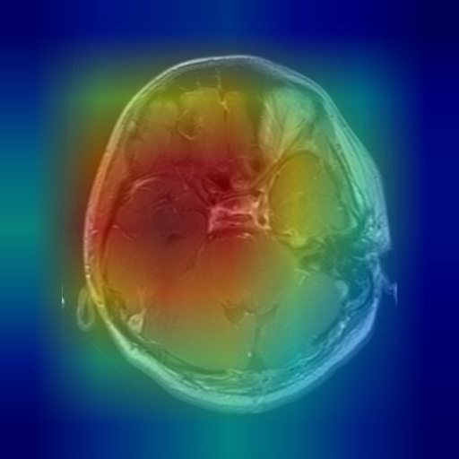

# Brain Tumor Classification with Grad-CAM

This project is a capstone deep learning model for classifying brain MRI images into four categories: `glioma`, `meningioma`, `pituitary tumor`, and `no tumor`.

## 📂 Dataset
The model uses the [Kaggle Brain MRI Dataset](https://www.kaggle.com/datasets/masoudnickparvar/brain-tumor-mri-dataset), consisting of 15,000+ images across:
- Training
- Validation (created via split)
- Testing

## 🧠 Model
- **Architecture:** Pretrained ResNet18
- **Fine-tuning:** Last few layers updated for 4-class classification
- **Accuracy:** >99% validation accuracy

## 🔍 Explainability
Grad-CAM is used to highlight regions of the MRI that influenced predictions.



## 🛠️ Tools
- PyTorch, Torchvision
- PIL, Matplotlib
- Python 3.10 (via pyenv)

## 🧪 Run Locally
```bash
# Train
python main.py

# Run Grad-CAM
python test_gradcam.py

